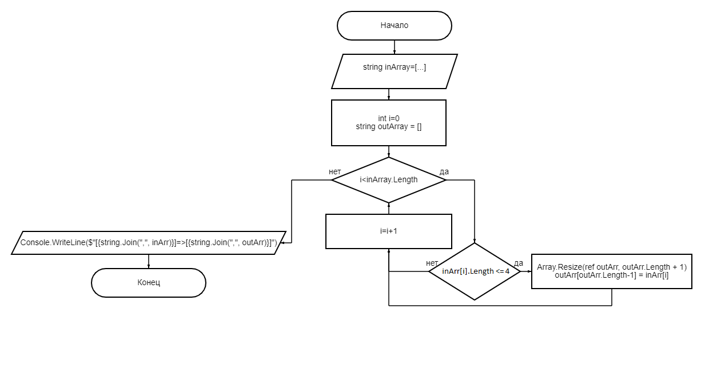

# Контрольная работа

## Задание №1:

Создать репозиторий.

Выполнение: Довольно просто создаётся новый удалённый репозиторий на ГитХаб. После чего он привязывается к локальному, для дальнейшей работы над проектом.

## Задание №2:

Нарисовать блок-схему алгоритма

Выполнение: Рисуем блок-Схему к приложенной задаче. После чего, прикладываем её к данному файлу!

## Задание №3:

Снабдить репозиторий описанием решения.

Выполнение: Этим сейчас и занят!

## Задание №4: Написать программу, решающую поставленную задачу

Задача: Написать программу, которая из имеющегося массива строк формирует массив из строк, длина которых меньше либо равна 3 символа
Первоначальный массив можно ввести с клавиатуры, либо задать на старте выполнения алгоритма
При решении не рекомендуеться пользоваться коллекциями, лучше обойтись исключительно массивами